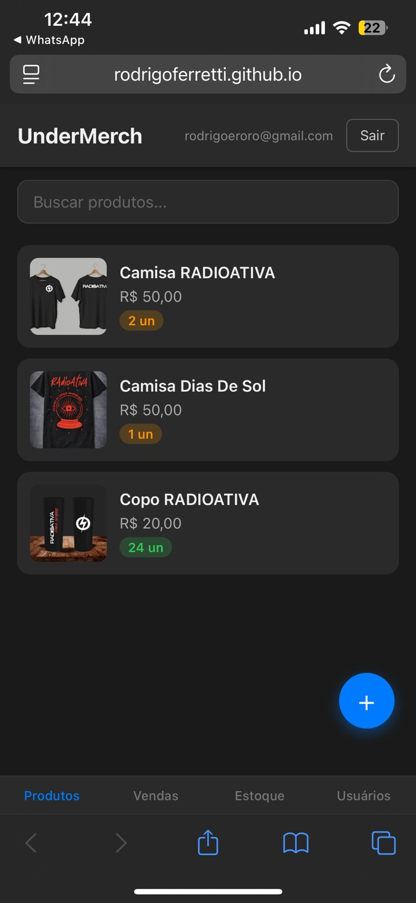
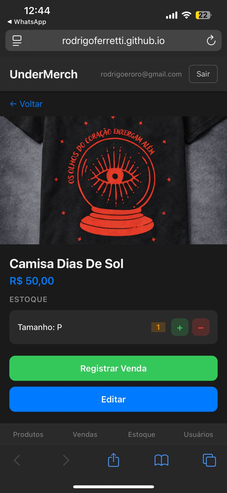
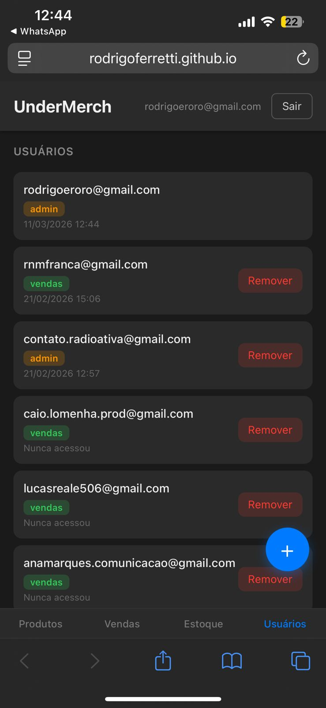

# Relatorio do Projeto de Extensao (PEX) — UnderMerch

**Aluno:** Rodrigo Ferretti<br>
**Curso:** Analise e Desenvolvimento de Sistemas<br>
**Instituicao:** Faculdade Descomplica<br>
**Repositorio:** https://github.com/RodrigoFerretti/under-merch

---

## 1. Introducao

### 1.1 Problema Identificado

A banda RADIOATIVA, atuante na cena independente, enfrenta dificuldades recorrentes na gestao de merchandise durante shows. Os problemas observados incluem:

- **Desorganizacao do estoque:** produtos guardados em malas sem catalogacao, dificultando localizar tamanhos e modelos durante o show.
- **Demora nas vendas:** tempo excessivo para encontrar itens, levando clientes a desistir da compra.
- **Ausencia de controle:** sem registro de vendas, estoque ou historico — tudo feito de memoria ou em anotacoes informais.
- **Falta de dados para decisao:** sem visibilidade sobre quais produtos vendem mais, em quais eventos, ou quanto de estoque resta.

### 1.2 Proposta de Solucao

Desenvolver um sistema web para controle de produtos, estoque, vendas e usuarios, com foco em simplicidade e uso mobile durante shows. O sistema deveria funcionar sem custo de infraestrutura e ser facil de configurar por qualquer banda independente.

---

## 2. Objetivo de Desenvolvimento Sustentavel (ODS)

### ODS 8 — Trabalho Decente e Crescimento Economico

O projeto contribui para a ODS 8 ao:

- **Profissionalizar a operacao** de bandas independentes, substituindo controle informal por um sistema estruturado.
- **Reduzir perdas financeiras** causadas por descontrole de estoque e vendas nao registradas.
- **Fomentar o empreendedorismo cultural**, oferecendo uma ferramenta gratuita e open source para artistas locais.
- **Apoiar a sustentabilidade economica** de bandas que dependem da venda de merch como fonte de renda.

---

<div style="page-break-before: always"></div>

## 3. Solucao Implementada

### 3.1 Arquitetura

O sistema foi construido com uma stack de custo zero, usando servicos gratuitos do Google:

```
GitHub Pages (Frontend)  -->  Google Apps Script (API)  -->  Google Sheets (Banco de Dados)
                                       |
                                Google Drive (Imagens)
```

| Camada | Tecnologia | Funcao |
|--------|-----------|--------|
| Frontend | HTML/CSS/JS vanilla, hospedado no GitHub Pages | Interface do usuario, responsiva e mobile-first |
| Backend | Google Apps Script (TypeScript compilado para GS) | API REST-like, logica de negocios, autenticacao |
| Banco de Dados | Google Sheets (5 abas: Users, Products, SKUs, Movements, Sales) | Armazenamento de todos os dados do sistema |
| Imagens | Google Drive (compartilhamento publico por link) | Fotos dos produtos |
| CI/CD | GitHub Actions | Deploy automatico do frontend (Pages) e backend (clasp push) |
| Autenticacao | Google OAuth 2.0 (Google Identity Services) | Login seguro via conta Google |

### 3.2 Funcionalidades

**Gestao de Produtos:**
- Cadastro com nome, descricao, preco e imagem (via Google Drive)
- Variantes por SKU (ex: tamanho P, M, G)
- Busca por nome na listagem

**Controle de Estoque:**
- Visualizacao de estoque por produto e SKU
- Registro de entradas e saidas com motivo
- Historico completo de movimentacoes

**Registro de Vendas:**
- Interface otimizada para uso rapido durante shows
- Selecao de produto, SKU, quantidade e forma de pagamento
- Baixa automatica no estoque ao registrar venda
- Historico de vendas com filtros

**Sistema de Usuarios e Permissoes:**
- Autenticacao via Google OAuth 2.0
- Tres niveis de acesso: `admin`, `vendas`, `estoque`
- Gestao de usuarios com adicao/remocao pelo admin
- Registro de ultimo acesso por usuario
- Renovacao automatica de token com retry silencioso

---

## 4. Evidencias

### 4.1 Listagem de Produtos



Tela principal do sistema mostrando os produtos cadastrados (Camisa RADIOATIVA, Camisa Dias De Sol, Copo RADIOATIVA) com imagem, preco e quantidade em estoque. Interface acessada via celular em rodrigoferretti.github.io.

### 4.2 Detalhe de Produto e Registro de Venda



Tela de detalhe de um produto (Camisa Dias De Sol — R$ 50,00) com controle de estoque por tamanho (SKU) e botoes para registrar venda e editar o produto.

### 4.3 Gestao de Usuarios



Tela de gerenciamento de usuarios mostrando os membros cadastrados com suas respectivas roles (`admin`, `vendas`) e datas de ultimo acesso. O admin pode remover usuarios diretamente pela interface.

---

## 5. Aprendizados

### 5.1 Competencias Desenvolvidas

- **Arquitetura sem servidor:** projetar um sistema completo usando apenas servicos gratuitos (Google Sheets como banco, Apps Script como backend, GitHub Pages como hosting).
- **Google Apps Script e clasp:** desenvolvimento em TypeScript com deploy automatizado via CLI, incluindo CI/CD com GitHub Actions.
- **OAuth 2.0:** implementacao de autenticacao real com Google Identity Services, incluindo renovacao silenciosa de tokens.
- **Controle de acesso por roles:** sistema de permissoes com tres niveis, gerenciado via planilha e aplicado no backend.
- **Levantamento de requisitos com stakeholders reais:** entender a dinamica de vendas em shows e traduzir em funcionalidades praticas.

### 5.2 Desafios Enfrentados

- **Limitacoes do Apps Script:** sem suporte a headers customizados, sem CORS nativo, todas as respostas retornam HTTP 200. A solucao foi enviar tokens no body do POST e tratar status via JSON.
- **Google Sheets como banco:** sem indices, sem queries complexas, sem transacoes. Funciona bem para o volume de dados de uma banda, mas exigiu cuidado no design das abas.
- **Deploy do Apps Script:** cada alteracao exige criar uma nova versao da implantacao. Resolvido com CI/CD via GitHub Actions + clasp.

---

## 6. Conclusao

O UnderMerch foi desenvolvido e entregue como um sistema funcional, em uso real pela banda RADIOATIVA. A solucao atende ao problema identificado — controle de merch durante shows — com uma stack de custo zero e setup acessivel para qualquer banda independente.

O sistema esta publicado em https://github.com/RodrigoFerretti/under-merch com documentacao completa de setup, permitindo que outras bandas repliquem a solucao para suas proprias necessidades.

---

**Rodrigo Ferretti**
Analise e Desenvolvimento de Sistemas — Faculdade Descomplica
